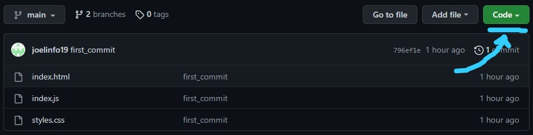
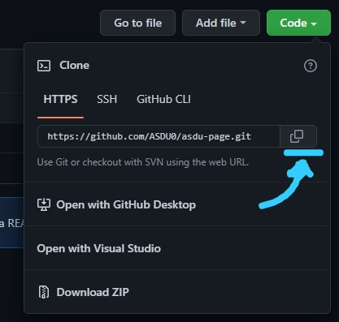
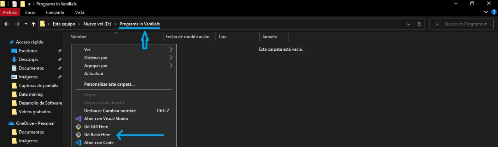
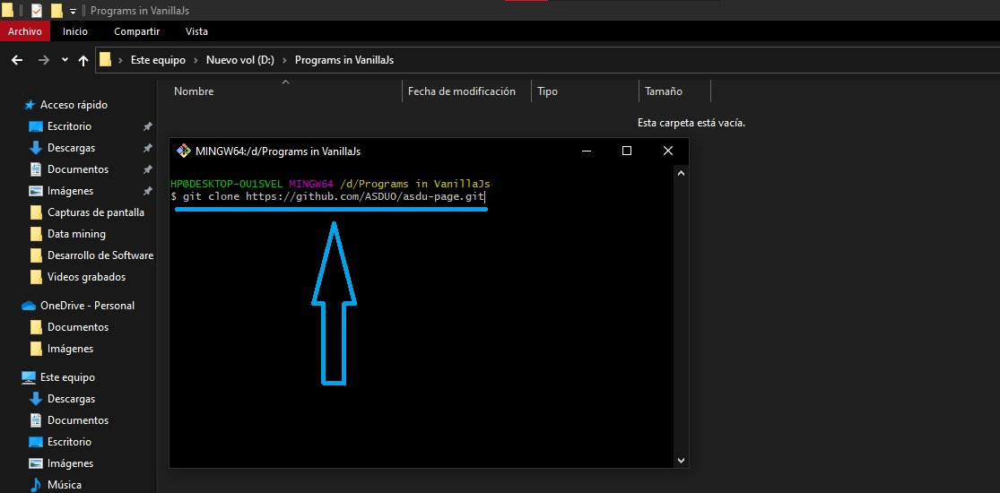
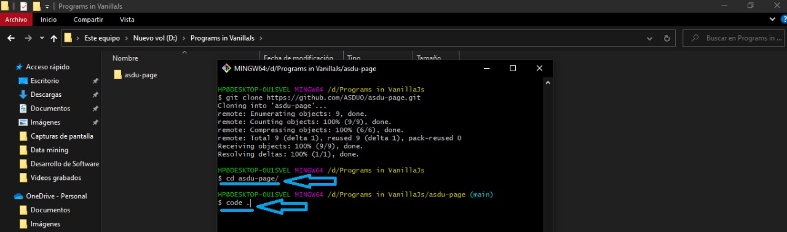
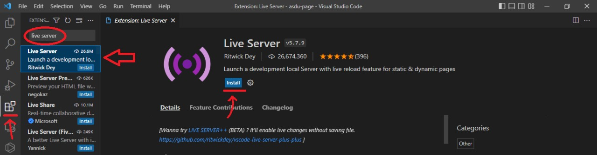
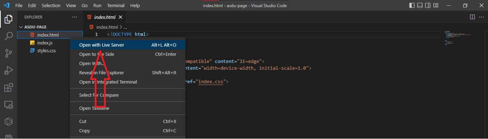
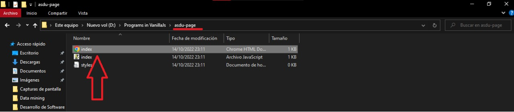
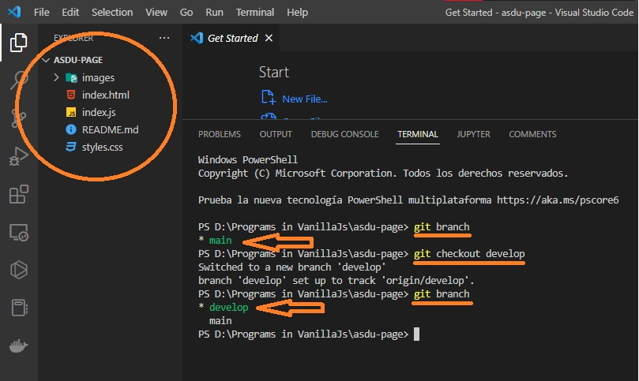
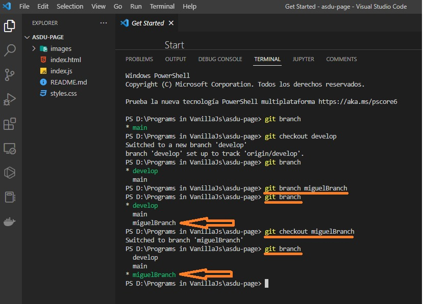

# asdu-page

## LINKS

- [UI/UX](https://www.figma.com/file/Vld6yw6rr2YrphmBkIfslS/Notice-project?type=design&node-id=86%3A39&t=FI152LRbuqlvJwCz-1)

# ASDU page

ASDU is a new platform for the Software Development study group, it describes us personally and our interests. The main objective is to help users find information about what we are and what we do.

To do so, we are creating a new web application that allows users to meet us and explore among sophisticated things.

## What you have to do?

ASDU page needs you to implement some awesome components where users can see information about all new updates.

## What do you need to start?

**01.-** If you have **git**, you need to clone the repository starting by copying the link like so:





**02.-** Then you create a folder on your computer and continue:




```
git clone https://github.com/ASDU0/asdu-page.git
```

```
cd asdu-page/
code .
```
## How to run the App to start?
To start a local development server with live reloading for the **ASDU** static web page you can do it via an extension called **Live Server** or simply by opening the **index.html** file.

**01.- Live Server:** For this option you have to download the extension as in the following image:



And then the following option will appear and that's it.



**01.- index.html:** For this option you only need to select the file from the directory as in the image and that's it.




## IMPORTANT NOTES TO TAKE INTO ACCOUNT...!

If you are going to take an issue, you need to create a branch from **"develop"** and for that, check which branch you are in with the following command:

```
git branch
```
If you're on the main branch, first switch to the **"develop branch"** with the following command and check again:
```
git checkout develop
git branch
```


Now, being in the **"develop"** branch, you must create a new branch where you can make the issue with the following command line:

```
git branch <name_of_your_branch>
git checkout <name_of_your_branch>
```


When you see that you are in your branch created as in the image you can work there, good luck...!
